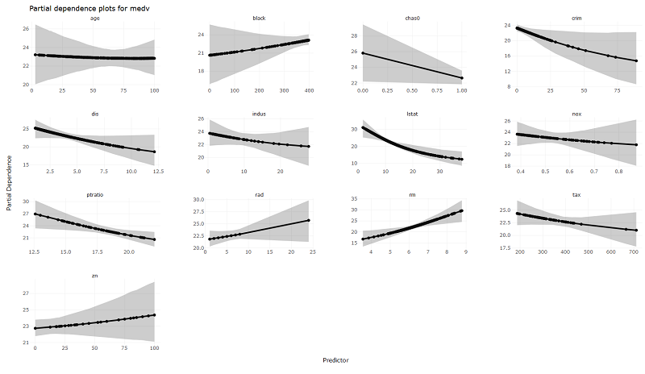
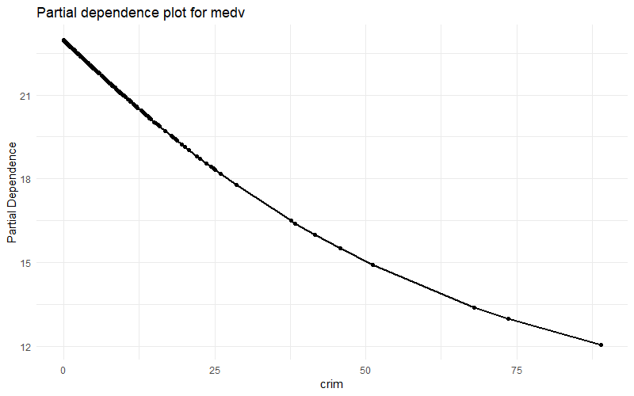
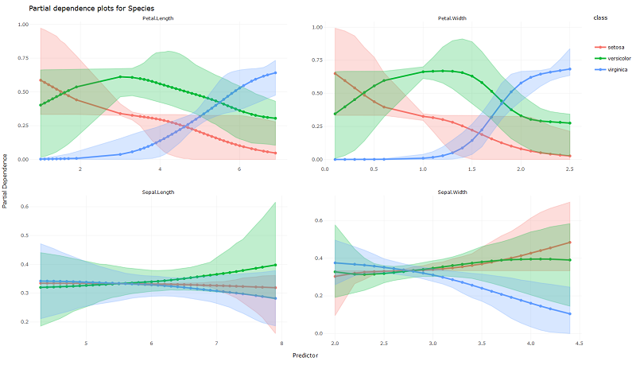
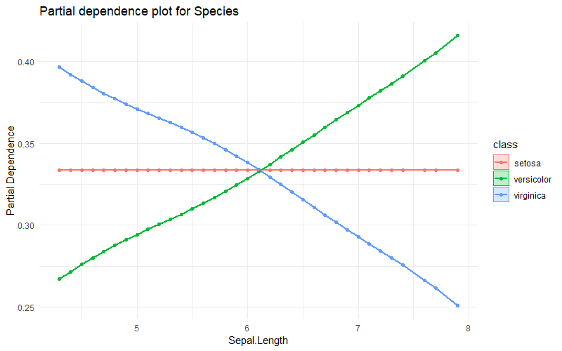
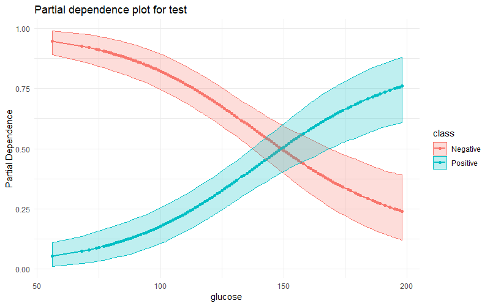

# NeuralNetworkVisualization

[](https://travis-ci.com/AlexAfanasev/NeuralNetworkVisualization)
[](https://codecov.io/gh/AlexAfanasev/NeuralNetworkVisualization)

> *Copyright 2019 Jacqueline Dorothea Seufert, Alex Afanasev. Licensed under the MIT license.*

`NeuralNetworkVisualization` is a R Package for creating beautiful partial dependence plots for Neural Networks using ggplot2, plotly and shiny.

This software was developed by **Jacqueline Dorothea Seufert** and **Alex Afanasev** and is available freely.

## Installation
`NeuralNetworkVisualization` is available through GitHub:

To install the latest development version from GitHub:

``` r
install.packages("devtools")
devtools::install_github("AlexAfanasev/NeuralNetworkVisualization")
```

## Examples
Step by step procedure:
1. Fit  a neural network using the NeuralNetwork class (uses the famous neuralnet package for fitting the model)
2. Create visualizations of the partial dependencies using the plot_partial_dependencies function (creates visualizations in ggplot2 and if wanted in plotly, adds a confidence interval)

**Numerical response variable:**
```r
library(NeuralNetworkVisualization)

# Example for Plotting with numerical dependent variable
library(MASS)
data <- Boston; data$chas <- as.factor(data$chas)
train <- data

set.seed(1)
model <- NeuralNetwork(medv ~ ., data = train, layers = c(5, 3),
                       scale = TRUE, linear.output = TRUE, threshold = 0.5)

plot_partial_dependencies(model, probs = c(0.1, 0.9), nrepetitions = 5)
```


```r
plot_partial_dependencies(model, predictors = "crim", probs = c(0.05, 0.95),
                          nrepetitions = 5)
```


```r
plot_partial_dependencies(model, predictors = c("crim", "age"),
                          type = "ggplotly", probs = c(0.05, 0.95),
                          nrepetitions = 5)
```



**Categorical response variable:**
```r
library(NeuralNetworkVisualization)

# Example for Plotting with categorical dependent variable
library(datasets)
data("iris")
train_model <- iris

set.seed(1)
model <- NeuralNetwork(
    Species ~ .,
    data = train_model, layers = c(5, 5), rep = 5, linear.output = FALSE,
    scale = TRUE, err.fct = "ce", stepmax = 1000000, threshold = 0.5)

plot_partial_dependencies(model, probs = c(0.1, 0.9), nrepetitions = 5,
                          type = "ggplotly")
```


```r
plot_partial_dependencies(model, predictors = "Sepal.Length")
```


```r
plot_partial_dependencies(model, predictors = c("Sepal.Length", "Petal.Length"),
                          type = "ggplotly", probs = c(0.1, 0.9),
                          nrepetitions = 20)
```


**Binary response variable:**
```r
library(NeuralNetworkVisualization)

# Example for Plotting with binary dependent variable
library(faraway)
pima$glucose[pima$glucose == 0] <- NA
pima$diastolic[pima$diastolic == 0] <- NA
pima$triceps[pima$triceps == 0] <- NA
pima$insulin[pima$insulin == 0] <- NA
pima$bmi[pima$bmi == 0] <- NA
pima <- pima[complete.cases(pima), ]
pima$test <- as.factor(pima$test)
levels(pima$test) <- c("Negative", "Positive")
train <- pima

set.seed(1)
model <- NeuralNetwork(test ~ pregnant + glucose + diastolic + triceps +
                           insulin + bmi + diabetes + age, data = train,
                       layers = 2, err.fct = "ce", linear.output = FALSE,
                       threshold = 0.5, stepmax = 1e6)

plot_partial_dependencies(model, probs = c(0.1, 0.9), nrepetitions = 5)
```


```r
plot_partial_dependencies(model, predictors = "glucose")
```


```r
plot_partial_dependencies(model, predictors = c("pregnant", "diastolic"),
                          type = "ggplotly", probs = c(0.05, 0.95),
                          nrepetitions = 5)
```


## Shiny App

**Please run the shiny app within a modern browser. Dont be stupid tryng to use Microsoft Internet Explorer or Edge.**

**Run the shiny app:**
```r
library(NeuralNetworkVisualization)
run_shiny_app()
```


## Sources
* https://towardsdatascience.com/first-neural-network-for-beginners-explained-with-code-4cfd37e06eaf
* https://www.datacamp.com/community/tutorials/neural-network-models-r
* https://towardsdatascience.com/introducing-pdpbox-2aa820afd312
* https://christophm.github.io/interpretable-ml-book/pdp.html
* https://bgreenwell.github.io/pdp/articles/pdp.html

